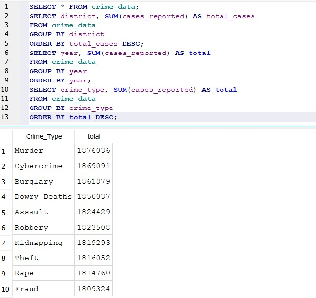
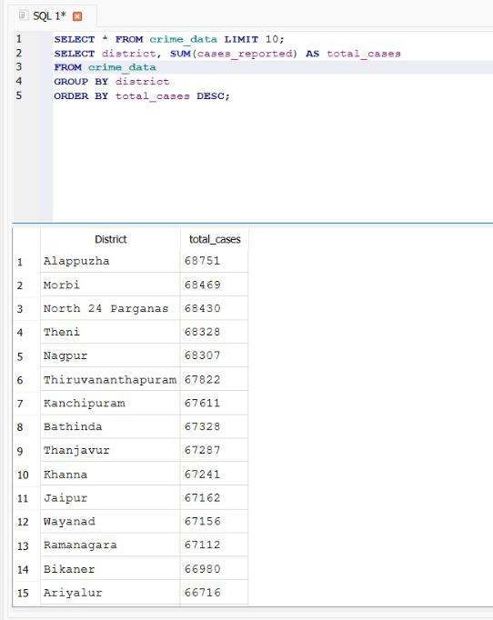
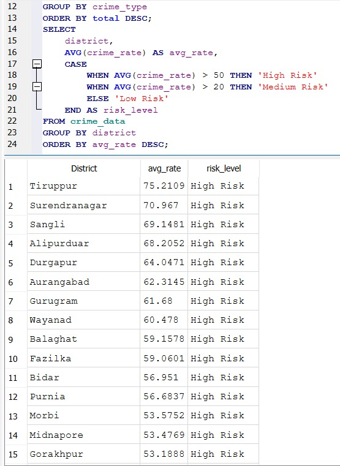
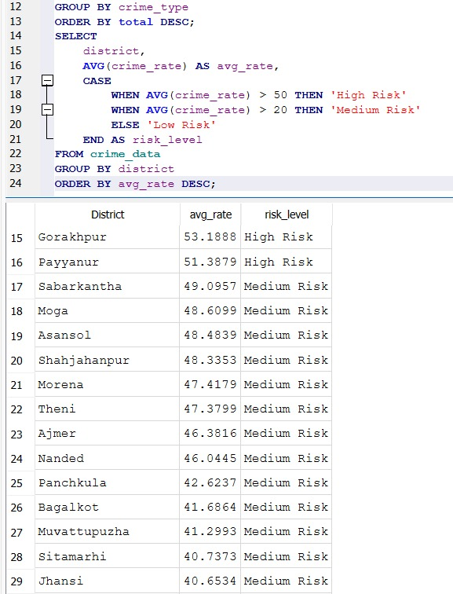
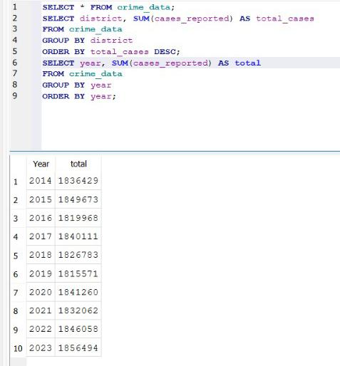

# 🚓 Crime Risk Analysis and Early Warning System

## 📌 Objective

This project analyzes crime data across different districts and years to identify patterns and high-risk areas that require police attention.

## 📊 Dataset

The dataset contains:

* State
* District
* Year
* Crime Type
* Cases Reported
* Population
* Crime Rate

## 🛠 Tools Used

* SQL (SQLite)
* Excel

## 🔍 Analysis Performed

* District-wise crime analysis
* Year-wise crime trends
* Crime type distribution
* Risk classification system

## 🚨 Risk System

A simple rule-based system is developed using crime rate:

* High Risk: Crime rate > 50
* Medium Risk: Crime rate > 20
* Low Risk: Crime rate ≤ 20

## 📈 Key Insights

* Certain districts consistently show higher crime volume and require increased monitoring.
* Crime trends vary across years but remain relatively stable overall.
* Some crime types dominate across multiple regions.

## 📂 Project Structure

crime-data-analysis/
│── crime_data.csv
│── queries.sql
│── screenshots/
│── README.md

##Screenshot

## 📸 Screenshots

### 📊 Crime Type Analysis

### 📍 District Analysis

### ⚠️ Risk System

### 📈 Year Trend

## 🚀 Conclusion

This project demonstrates how data analysis can support decision-making in law enforcement. It can be extended into a predictive system using machine learning.

